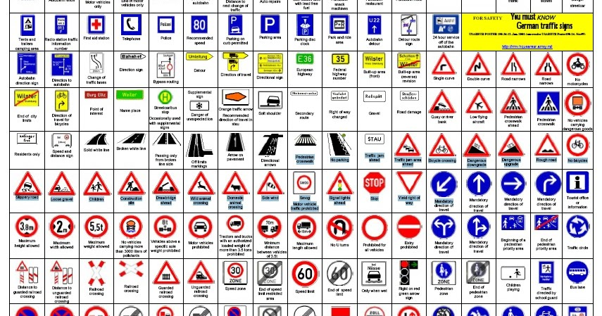
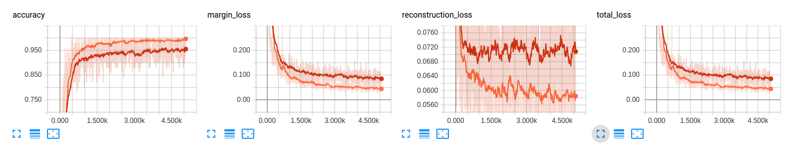
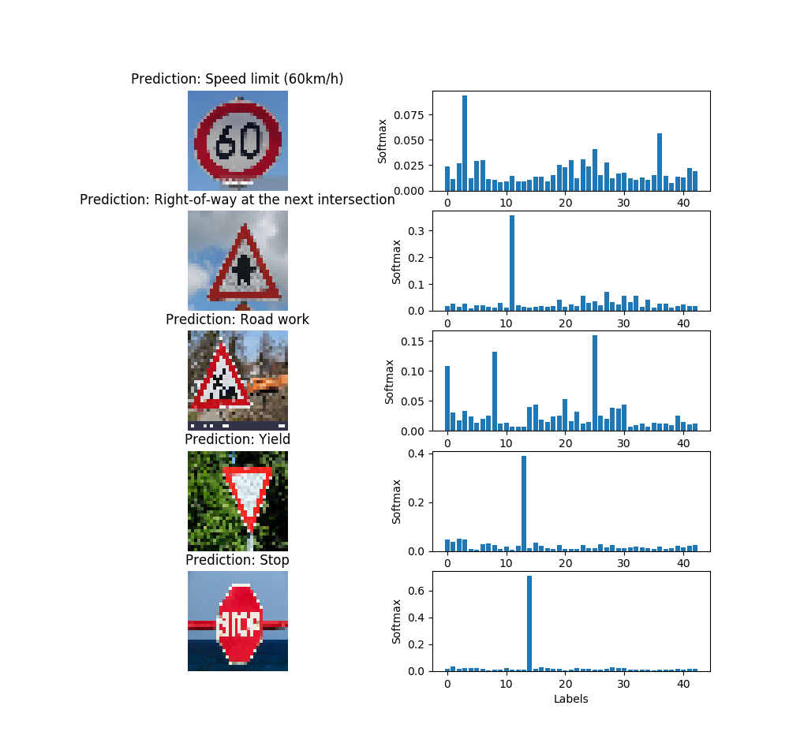

# Capsnet - Traffic sign classifier - Tensorflow

A Tensorflow implementation of CapsNet(Capsules Net) apply on the German traffic sign dataset

This implementation is based on this paper: <b>Dynamic Routing Between Capsules</b> (https://arxiv.org/abs/1710.09829) from Sara Sabour, Nicholas Frosst and Geoffrey E. Hinton.

This repository is a work in progress implementation of a Capsules Net. Since I am using a different dataset (Not MNIST) some details in the architecture are different. The code for the CapsNet is located in the following file: <b>caps_net.py</b> while the whole model is created inside the <b>model.py</b> file. The two main methods used to build the CapsNet are  <b>conv_caps_layer</b> and <b>fully_connected_caps_layer</b>

</img>

## Requirements
- Python 3
- NumPy 1.13.1
- Tensorflow 1.3.0
- docopt 0.6.2
- Sklearn: 0.18.1

## Install

    $> git clone https://github.com/thibo73800/capsnet_traffic_sign_classifier.git
    $> cd capsnet_traffic_sign_classifier.git
    $> wget https://d17h27t6h515a5.cloudfront.net/topher/2017/February/5898cd6f_traffic-signs-data/traffic-signs-data.zip
    $> unzip traffic-signs-data.zip
    $> mkdir dataset
    $> mv *.p dataset/
    $> rm traffic-signs-data.zip
   
## Train

    $> python train.py -h
    $> python train.py dataset/

During the training, the checkpoint is saved by default into the outputs/checkpoints/ folder. The exact path and name of the checkpoint is print during the training.

## Test

In order to measure the accuracy and the loss on the Test dataset you need to used the test.py script as follow:

    $> python test.py outputs/checkpoints/ckpt_name dataset/ 

## Metrics / Tensorboard

<b>Accuracy: </b>
<ul>
    <li>Train: 99%</li>
    <li>Validation: 97%</li>
    <li>Test: 94%</li>
</ul>

Checkpoints and tensorboard files are stored inside the <b>outputs</b> folder.

</img>

Exemple of some prediction:

</img>

